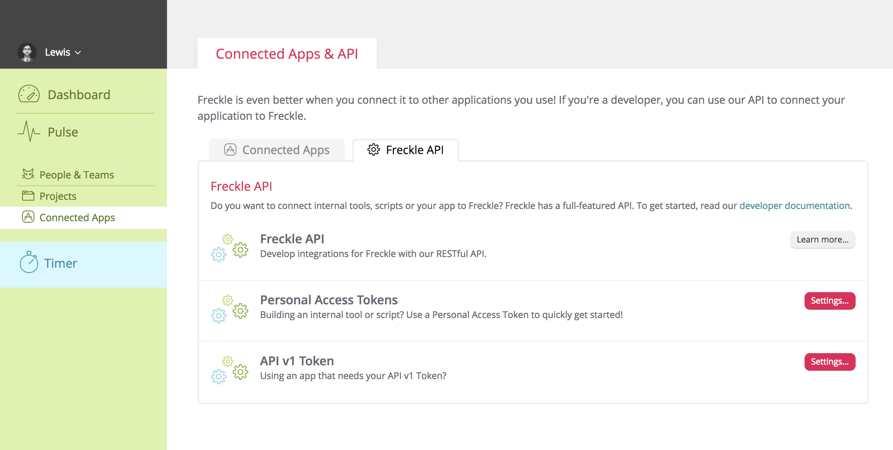
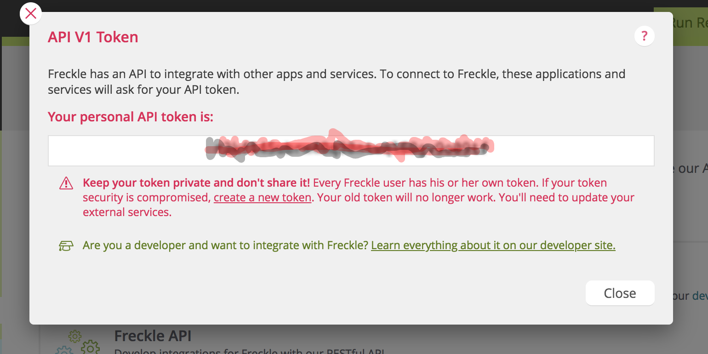

# freckle-automate
Automate freckle checkins

TODO : Systems to be integrated

**Unbillable Leadership hours**

- [ ] Google Calendar (All activities)
- [ ] Github (OSS)
- [ ] Blog (Github pages)
- [ ] Speaker Deck 
- [ ] Greenhouse (Interviews)


**Billable hours**

- [ ] Github


## Installation

1. Install [pippi](https://github.com/sirkitree/pippi). This is a command line tool for accessing the
`freckle` api.

```shell
npm install pippi -g
```
2. Get your personal `freckle` configuration 

Get your `OAuth` token

 

 


3. Configure `Pippi`, by creating a file `sudo nano ~/.freckle` with the following content. Remember to configure it properly.

```json
{
    "subdomain": "subdomain",
    "token": "your personal token",
    "user": "myname@subdomain.com"
}
```

Now, if you want 


## How to use


